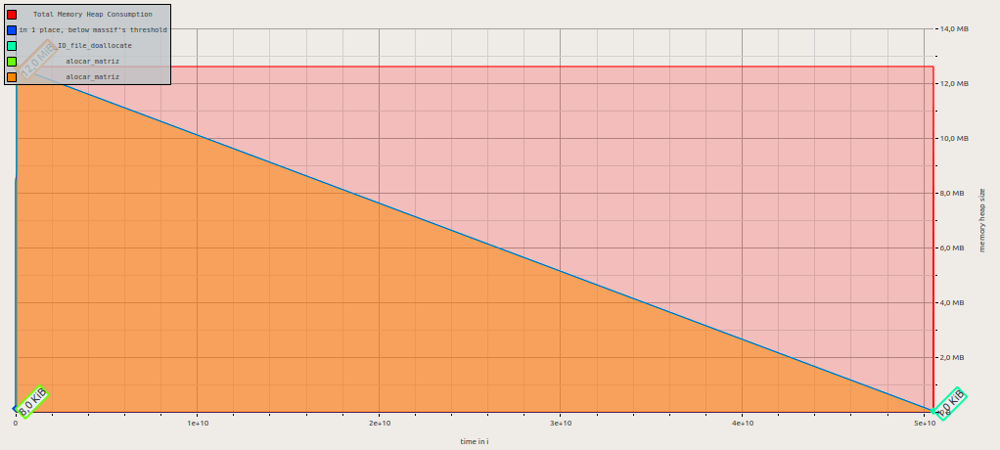
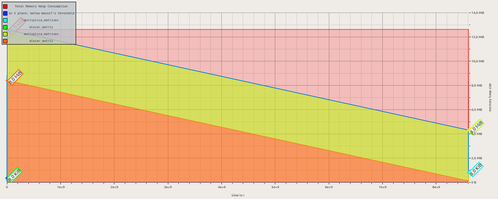
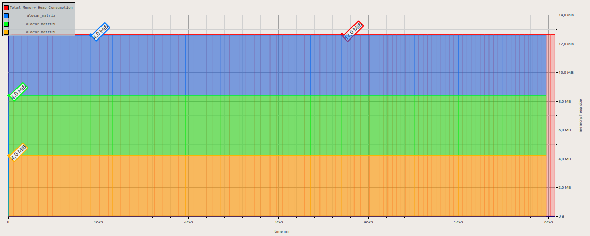
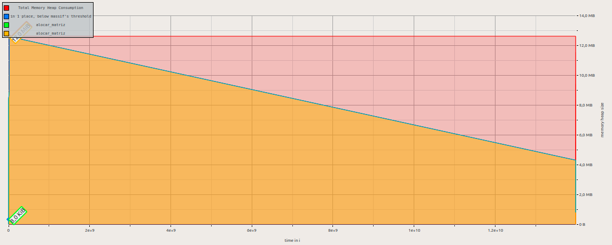

# MatrixMultiplicationOtimization

## Otimizações no algoritmo de Multiplicação de Matrizes

Arquivos no repositório:
  * [mult_mat_simples.c](https://github.com/juan-burtet/MatrixMultiplicationOtimization/blob/master/mult_mat_simples.c)
    > Versão trivial do algoritmo de multiplicação de matrizes
  * [mult_mat_SIMD.c](https://github.com/juan-burtet/MatrixMultiplicationOtimization/blob/master/mult_mat_SIMD.c)
    > Versão utilizando instruções SIMD para multiplicação de matrizes
  * [simples.txt](https://github.com/juan-burtet/MatrixMultiplicationOtimization/blob/master/simples.txt)
    > Arquivo com as informações do Valgrind no teste Simples
  * [simplesflags.txt](https://github.com/juan-burtet/MatrixMultiplicationOtimization/blob/master/simplesflags.txt)
    > Arquivo com as informações do Valgrind no teste Simples utilizando as flags do compilador
  * [simd.txt](https://github.com/juan-burtet/MatrixMultiplicationOtimization/blob/master/simd.txt)
    > Arquivo com as informações do Valgrind no teste utilizando instruções SIMD
  * [simdflags.txt](https://github.com/juan-burtet/MatrixMultiplicationOtimization/blob/master/simdflags.txt)
    > Arquivo com as informações do Valgrind no teste utilizando instruções SIMD + flags do compilador
  * [simples.png](https://github.com/juan-burtet/MatrixMultiplicationOtimization/blob/master/simples.png)
    > Imagem com as informações do Valgrind no teste Simples
  * [simplesflags.png](https://github.com/juan-burtet/MatrixMultiplicationOtimization/blob/master/simplesflags.png)
    > Imagem com as informações do Valgrind no teste Simples utilizando as flags do compilador
  * [simd.png](https://github.com/juan-burtet/MatrixMultiplicationOtimization/blob/master/simd.png)
    > Imagem com as informações do Valgrind no teste utilizando instruções SIMD
  * [simdflags.png](https://github.com/juan-burtet/MatrixMultiplicationOtimization/blob/master/simdflags.png)
    > Imagem com as informações do Valgrind no teste utilizando instruções SIMD + flags do compilador

## mult_mat_simples.c

Faz a multiplicação de matrizes de maneira trivial.

Para executar o código, insira:
  > gcc mult_mat_simples.c -o __executavelsimples__

Para executar o código com as flags de vetorização automática, insira:
  > gcc -funsafe-math-optimizations -march=native -O3 -ftree-vectorize -fopt-info-vec-optimized -fopt-info-vec-missed mult_mat_simples.c -o __executavelsimplesflags__

## mult_mat_SIMD.c

Faz a multiplicação de matrizes utilizando Instruções SIMD + Vetorização

Para executar o código, insira:
  > gcc -march=native -O2 mult_mat_SIMD.c -o __executavelsimd__

Para executar o código com as flags de vetorização automática, insira:
  > gcc -funsafe-math-optimizations -march=native -O3 -ftree-vectorize -fopt-info-vec-optimized -fopt-info-vec-missed mult_mat_simples.c -o __executavelsimdflags__

## Diferença de tempo

\- | Simples | Simples + Flags | SIMD | SIMD + Flags
-- | ------- | --------------- | ---- | ------------
Tempo (ms) | 11.489 | 2.030 | 902 | 2.021

## Informação de Memória no Valgrind

\- | Simples | Simples + Flags | SIMD | SIMD + Flags
-- | ------- | --------------- | ---- | ------------
Bytes Alocados | 12,608,584 | 12,608,584 | 12,592,176 | 12,608,584

### Simples

### Simples + Flags

### SIMD

### SIMD + Flags

